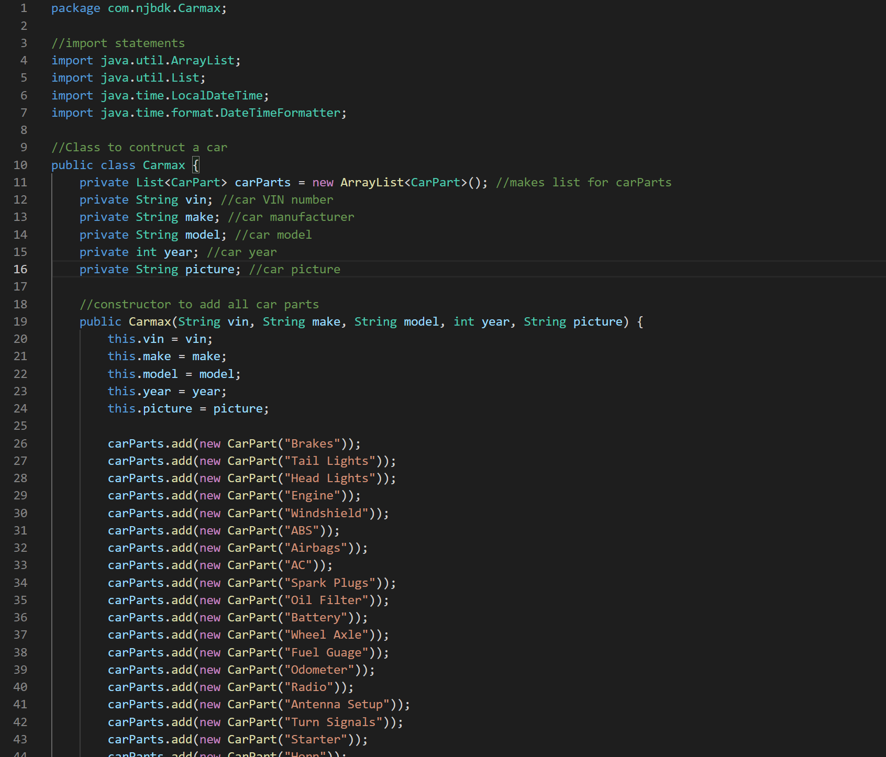
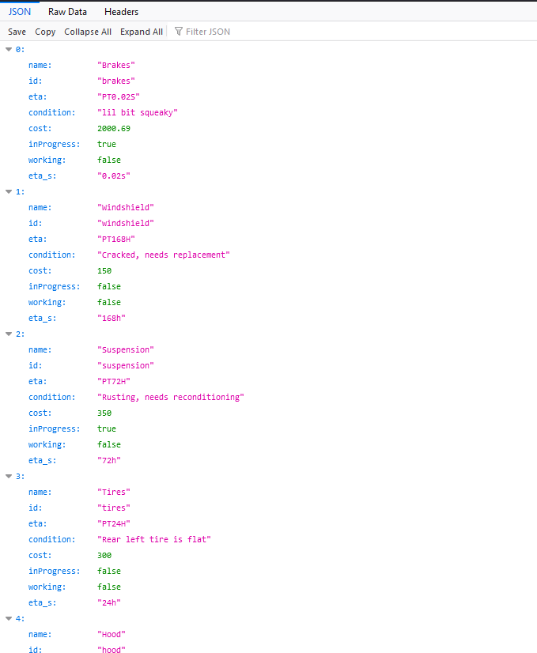
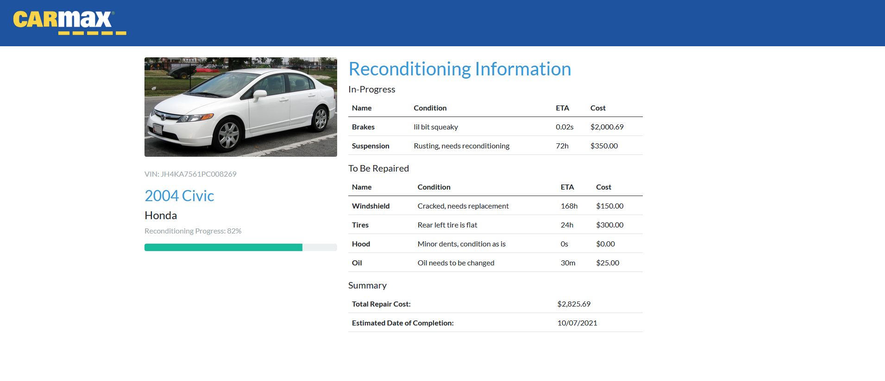
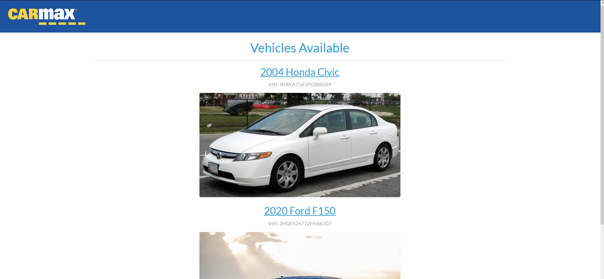

# RamHacks 2021

## Carmax Challenge Submission

Our Team:

 - Nathan Rowan
 - Jordan Dube
 - Ben Clark
 - Dana Cantillon
 - Kim Long Ly

## Our strategy

We chose to make a backend using Java, which communicates data through Spring Boot. The site has multiple RESTful api endpoints for querrying various information such as cars available, parts in the car, parts being repaired, and specific information about individual parts being repaired.

For the frontend of our site, Spring communicates information to ThymeLeaf which generates dynamic web content to display on our site, which is structured using the Bootstrap css framework. By using different VIM numbers as query parameters, information about different cars are displayed such as Make, Model, year, parts in repair, parts that will be repaired, overall repair progress, an ETA for when the car is ready, and the total cost of all the repairs being made. 

We also include a home page to view all car listings, and an error page if the VIM number is missing or incorrectly typed.

